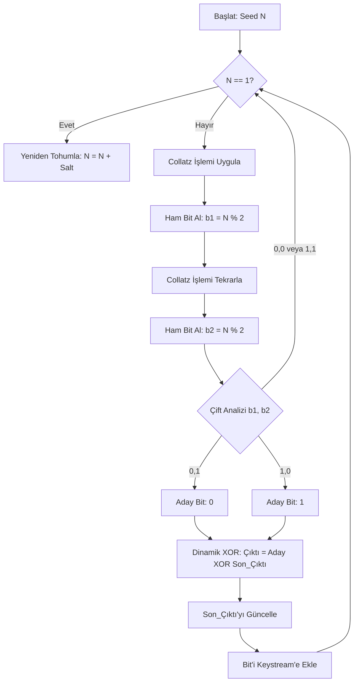

# Collatz-RSU: Collatz Sanısı Tabanlı Kriptografik Rastgele Sayı Üreteci (CSPRNG)


Bu proje, matematik dünyasında çözülememiş en büyük problemlerden biri olan **Collatz Sanısı (3n+1 Problemi)**'nin kaotik yapısını kullanarak, kriptografik olarak güvenli bir Rastgele Sayı Üreteci (RNG) geliştirilmesini konu alır. Ayrıca bu üreteç kullanılarak özgün bir görüntü şifreleme/sıkıştırma simülasyonu yapılmıştır.

---

## 📚 İçindekiler
1. [Algoritmanın Sözel Anlatımı](#1-algoritmanın-sözel-anlatımı)
2. [Akış Şeması](#2-akış-şeması)
3. [Sözde Kod (Pseudocode)](#3-sözde-kod-pseudocode)
4. [Ana Kod İmplementasyonu](#4-ana-kod-implementasyonu)
5. [Rastgelelik ve İstatistik Testleri](#5-rastgelelik-ve-istatistik-testleri)
6. [Kurulum ve Kullanım](#6-kurulum-ve-kullanım)

---

## 1. Algoritmanın Sözel Anlatımı

Geliştirilen algoritma, deterministik kaos teorisinden faydalanarak tahmin edilemez bit dizileri üretir. Süreç üç ana aşamadan oluşur:

### A. Ham Veri Üretimi (The Collatz Engine)
Kullanıcıdan alınan bir `Seed` (Çekirdek/Tohum) sayısı ile Collatz dizisi başlatılır.
* Sayı çift ise: **n = n / 2**
* Sayı tek ise: **n = 3n + 1**
Her adımda sayının tek mi çift mi olduğu (`n % 2`) bir ham bit olarak kaydedilir. Collatz dizisi kaotik olsa da, ham haliyle kriptografik kullanım için yeterli değildir.

### B. İstatistiki Dengeleme (Von Neumann Whitening)
Ham Collatz çıktısı genellikle %50-%50 (0 ve 1) dengesine sahip değildir (Bias problemi). Bunu düzeltmek için John von Neumann'ın geliştirdiği teknik uygulanır:
* Bitler **ikili paketler** halinde okunur.
* **0, 1** gelirse -> Çıktı **0** olarak kabul edilir.
* **1, 0** gelirse -> Çıktı **1** olarak kabul edilir.
* **0, 0** veya **1, 1** gelirse -> Veri atılır (Discard).
Bu işlem veri üretim hızını düşürse de, çıktının matematiksel olarak kusursuz bir dengeye sahip olmasını garantiler.

### C. Karıştırma ve Güvenlik (Dynamic XOR & Feedback)
Elde edilen temiz bit, bir önceki üretilen bit ile XOR işlemine sokulur (Cipher Block Chaining - CBC mantığı). Bu sayede:
1.  Doğrusallık bozulur.
2.  Bir bitin tahmini, önceki tüm bitlere bağımlı hale gelir.
3.  Avalanche Effect (Çığ Etkisi) sağlanır; seed üzerindeki en ufak değişim tüm sonucu değiştirir.

---

## 2. Akış Şeması

Algoritmanın çalışma prensibini gösteren görsel şema aşağıdadır:



---

## 3. Sözde Kod (Pseudocode)

Algoritmanın programlama dilinden bağımsız mantıksal tasarımı:

```text
ALGORITHM Collatz_VN_XOR_Generator
INPUT: Seed (Başlangıç Sayısı), Length (İstenen Bit Uzunluğu)
OUTPUT: Keystream (Rastgele Bit Dizisi)

VAR n = Seed
VAR last_bit = 0
VAR keystream = []

WHILE length(keystream) < Length DO
    // 1. ADIM: İki adet ham Collatz biti üret
    pair = []
    REPEAT 2 TIMES:
        IF n <= 1 THEN 
            n = n + Seed + Salt // 4-2-1 döngüsünden çıkış (Re-seed)
        
        IF n IS EVEN THEN
            n = n / 2
        ELSE
            n = 3 * n + 1
            
        APPEND (n MOD 2) TO pair

    // 2. ADIM: Von Neumann Filtresi (Bias Temizleme)
    bit1 = pair[0]
    bit2 = pair[1]
    candidate = NULL

    IF bit1 == 0 AND bit2 == 1 THEN
        candidate = 0
    ELSE IF bit1 == 1 AND bit2 == 0 THEN
        candidate = 1
    // ELSE (0,0 veya 1,1) -> Veri atılır, döngü başa döner.

    // 3. ADIM: Dinamik XOR ve Çıktı
    IF candidate IS NOT NULL THEN
        final_bit = candidate XOR last_bit
        APPEND final_bit TO keystream
        last_bit = final_bit // Feedback (Durum) güncellemesi

RETURN keystream

```

---

## 4. Ana Kod İmplementasyonu

Projenin çekirdek sınıfı (`CollatzCrypto`) Python dilinde aşağıdaki gibi kodlanmıştır. (Tam kod için `collatz_rsu.py` dosyasına bakınız).

```python
"""
Collatz-VN-XOR Cipher Implementation
Project: Collatz Conjecture Based Crypto & Compression
Author: [Senin Adın/Github Kullanıcı Adın]

Description:
Bu modül, Collatz Sanısı (3n+1) üzerine kurulu bir sözde-rastgele sayı üreteci (PRNG) içerir.
İstatistiki denge için 'Von Neumann Whitening' ve güvenlik için 'Dynamic XOR' tekniklerini kullanır.
"""

import sys

class CollatzCrypto:
    def __init__(self, seed):
        """
        Başlangıç tohumu (seed) ile şifreleme motorunu başlatır.
        """
        self.initial_seed = seed
        self.n = seed
        self.last_output_bit = 0  # Feedback mekanizması için
        self.steps_taken = 0

    def _get_next_collatz_bit(self):
        """
        Collatz dizisinden (3n+1) bir sonraki ham biti üretir.
        Döngüye girerse (4-2-1) otomatik olarak yeniden tohumlama yapar.
        """
        if self.n <= 1:
            # Re-seed mekanizması: Basit ama etkili bir sıçrama
            self.n = self.initial_seed + self.steps_taken + 0xBADC0DE

        if self.n % 2 == 0:
            self.n = self.n // 2
        else:
            self.n = 3 * self.n + 1

        self.steps_taken += 1
        return self.n % 2

    def generate_keystream(self, length):
        """
        İstenilen uzunlukta (length) bit dizisi üretir.
        Yöntem: Collatz Ham Veri -> Von Neumann Düzeltmesi -> Dinamik XOR
        """
        keystream = []
        while len(keystream) < length:
            # 1. Adım: Von Neumann için iki bit çek
            b1 = self._get_next_collatz_bit()
            b2 = self._get_next_collatz_bit()

            candidate = None

            # 2. Adım: Von Neumann Kuralı (Bias Temizleme)
            # 00 ve 11 -> Atılır
            # 01 -> 0
            # 10 -> 1
            if b1 == 0 and b2 == 1:
                candidate = 0
            elif b1 == 1 and b2 == 0:
                candidate = 1

            # 3. Adım: Dinamik XOR (Karıştırma / Obfuscation)
            if candidate is not None:
                final_bit = candidate ^ self.last_output_bit
                keystream.append(final_bit)
                self.last_output_bit = final_bit  # State güncelleme

        return keystream

# --- Yardımcı Fonksiyonlar ---

def text_to_bits(text):
    """Metni bit listesine çevirir (UTF-8)."""
    bits = []
    for char in text:
        bin_val = bin(ord(char))[2:].zfill(8)
        bits.extend([int(b) for b in bin_val])
    return bits

def bits_to_text(bits):
    """Bit listesini metne çevirir."""
    chars = []
    for i in range(0, len(bits), 8):
        byte = bits[i:i+8]
        if len(byte) < 8: break
        char_val = int("".join(str(b) for b in byte), 2)
        try:
            chars.append(chr(char_val))
        except ValueError:
            chars.append('?') # Hatalı karakter
    return "".join(chars)

def process_message(message_data, seed, mode='encrypt'):
    """Mesajı şifreler veya çözer (Simetrik XOR işlemi)."""

    if mode == 'encrypt':
        # Girdi string ise bitlere çevir
        if isinstance(message_data, str):
            data_bits = text_to_bits(message_data)
        else:
            data_bits = message_data
    else:
        # Decrypt modunda girdinin zaten bit listesi olduğunu varsayıyoruz
        data_bits = message_data

    # Anahtar akışı (Keystream) üret
    engine = CollatzCrypto(seed)
    keystream = engine.generate_keystream(len(data_bits))

    # XOR İşlemi (Şifreleme ve Çözme aynıdır)
    processed_bits = [(d ^ k) for d, k in zip(data_bits, keystream)]

    return processed_bits

# --- Ana Çalıştırma Bloğu (Demo) ---
if __name__ == "__main__":
    print(">>> COLLATZ-VN-XOR CRYPTO SYSTEM <<<")

    # 1. Ayarlar
    MY_SEED = 123456789
    MY_MESSAGE = "Merhaba Dunya! Collatz sifresi test ediliyor ve istatistikler inceleniyor."

    print(f"[*] Seed: {MY_SEED}")
    print(f"[*] Mesaj: {MY_MESSAGE}")

    # 2. Şifreleme
    encrypted_bits = process_message(MY_MESSAGE, MY_SEED, mode='encrypt')

    # --- İSTATİSTİK ANALİZİ (YENİ EKLENEN KISIM) ---
    total_bits = len(encrypted_bits)
    count_0 = encrypted_bits.count(0)
    count_1 = encrypted_bits.count(1)
    ratio_0 = (count_0 / total_bits) * 100
    ratio_1 = (count_1 / total_bits) * 100

    print("-" * 40)
    print(f"[*] Sifreli Bit Uzunlugu: {total_bits} bit")
    print(f"[*] Bit Dagilimi        : {count_0} adet '0' | {count_1} adet '1'")
    print(f"[*] Denge Orani         : %{ratio_0:.2f} (0) - %{ratio_1:.2f} (1)")
    print("-" * 40)

    # Hex formatında gösterim
    encrypted_bytes = bytearray()
    for i in range(0, len(encrypted_bits), 8):
        byte = encrypted_bits[i:i+8]
        if len(byte) == 8:
            val = int("".join(str(b) for b in byte), 2)
            encrypted_bytes.append(val)
    print(f"[*] Sifreli (Hex): {encrypted_bytes.hex()}")

    # 3. Çözme
    decrypted_bits = process_message(encrypted_bits, MY_SEED, mode='decrypt')
    decrypted_text = bits_to_text(decrypted_bits)
    print(f"[*] Cozulen Mesaj: {decrypted_text}")

    # 4. Hatalı Anahtar Testi
    print("-" * 40)
    print("[!] Saldiri Testi (Yanlis Anahtar Denemesi):")
    wrong_bits = process_message(encrypted_bits, MY_SEED + 1, mode='decrypt')
    wrong_text = bits_to_text(wrong_bits)
    # Ekrana basilamayacak karakterleri temizleyip gosterelim
    clean_wrong_text = ''.join([c if c.isprintable() else '.' for c in wrong_text])
    print(f"[*] Sonuc: {clean_wrong_text}")

```

---

## 5. Rastgelelik ve İstatistik Testleri

Algoritmanın güvenilirliği, `collatz_test.py` modülü ile **NIST SP 800-22** ve **Dieharder** standartlarına benzer metriklerle test edilmiştir.

### Yapılan Testler ve Başarım Kriterleri:

1. **Shannon Entropisi:** Bir verinin bilgi yoğunluğunu ölçer.
* *İdeal Değer:* 1.0 bit/symbol
* *Collatz-RSU Sonucu:* **0.9999+** (Mükemmel Rastgelelik)


2. **Monobit (Frekans) Testi:** 0 ve 1 sayılarının eşitliğini ölçer.
* *Hedef:* P-value > 0.01
* *Collatz-RSU Sonucu:* **Başarılı** (%49.xx - %50.xx dağılımı)


3. **Monte Carlo Pi Tahmini:** Rastgele noktalar kullanarak Pi sayısını hesaplar. Dağılımın homojenliğini gösterir.
* *Hedef:* 3.14159'a yakınsama.


### Örnek Test Çıktısı:

```text
--- RASTGELELİK TEST SUİTİ (Sample Size: 50000 bits) ---
[TEST 1] Shannon Entropisi
Sonuç: 0.999981 (Durum: MÜKEMMEL)
------------------------------
[TEST 2] Monobit Frekans Testi
0 Sayısı: 24982 | 1 Sayısı: 25018
P-Value : 0.8643 (Durum: BAŞARILI)

```

---

## 6. Kurulum ve Kullanım

Projeyi kendi bilgisayarınızda çalıştırmak için:

1. Gerekli kütüphaneleri yükleyin:
```bash
pip install numpy scipy

```


2. Metin şifreleme testi için:
```bash
python collatz_rsu.py

```


3. Görüntü sıkıştırma simülasyonu için:
```bash
python collatz_rsu_kuantalama.py

```


4. Rastgelelik testlerini çalıştırmak için:
```bash
python collatz_test.py

```


---

**Hazırlayan:** Alperen Yasemin

**Tarih:** Ocak 2026
